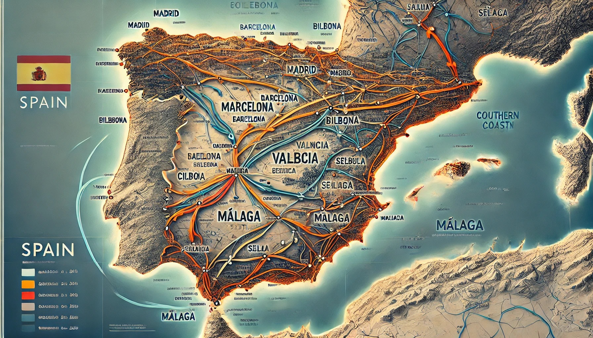
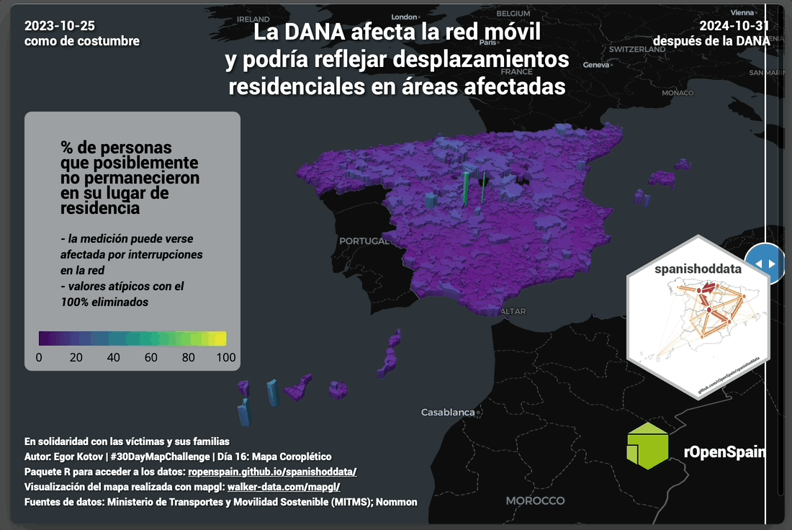

# 2024 \#30DayMapChallenge

<https://30daymapchallenge.com/>

# 1. Points

**Dominance of Female Commuters in Urban Destinations Across Spain**

To recreate the plot, use the
[`{spanishoddata}`](https://ropenspain.github.io/spanishoddata/) R
package and the [R/01-points.R](R/01-points.R) script in this
repository.

See threads on
[LinkedIn](https://www.linkedin.com/posts/egorkotov_30daymapchallenge-points-rstats-activity-7258040088348053504-gEX9),
[Mastodon](https://datasci.social/@EgorKotov/113406894220654694),
[Bluesky](https://bsky.app/profile/egorkotov.bsky.social/post/3l7tvg2nzlq2w),
[Twitter/X](https://x.com/EgorKotov/status/1852274386298167504).

# 2. Lines

**Gradual Recovery of Road Connectivity after the Passage of (storm)
DANA in Spain**

*In solidarity with the victims and their families.*

Affected road segments may be shorter. Check the exact kilometer
intervals at https://www.dgt.es/.

Credits to Virgilio Gómez-Rubio
([@precariobecario](https://x.com/precariobecario)) and Mireia Camacho
([@mireiacamacho75](https://x.com/mireiacamacho75)) for pointing me to
the data and
[capturing](https://github.com/DataMirai/ShinyCarreterasInundaciones/blob/main/carreteras_cortadas.csv)
the affected roads as of October 31.

To recreate the plot, use the [R/02-lines.R](R/02-lines.R) script in
this repository.

See threads on
[LinkedIn](https://www.linkedin.com/posts/egorkotov_30daymapchallenge-lines-roads-activity-7258387373883801600-xX3d),
[Mastodon](https://datasci.social/@EgorKotov/113412609537680635),
[Bluesky](https://bsky.app/profile/egorkotov.bsky.social/post/3l7xdzgeher2d),
[Twitter/X](https://x.com/EgorKotov/status/1852639535668359633).

# 3. Polygons

**Up to 2% of typical daily mobility in Spain was affected by (storm)
DANA**

The map shows the affected municipalities in Spain and emphasizes the
most affected areas by exaggerating the size of the polygons by the
number of trips.

*In solidarity with the victims and their families.*

Based on road incidents data by <https://www.dgt.es/> and open mobility
data by
[https://www.transportes.gob.es/](https://www.transportes.gob.es/ministerio/proyectos-singulares/estudios-de-movilidad-con-big-data/opendata-movilidad).

See threads on
[LinkedIn](https://www.linkedin.com/posts/egorkotov_30daymapchallenge-polygons-spain-activity-7258857807637004288-H9ww),
[Mastodon](https://datasci.social/@EgorKotov/113419659708438464),
[Bluesky](https://bsky.app/profile/egorkotov.bsky.social/post/3la2ie6nyoa2r),
[Twitter/X](https://x.com/EgorKotov/status/1853091018725302381).

# 4. Hexagons

*skipped for now*

# 5. A Journey

All journeys in Spain in one day.

https://github.com/user-attachments/assets/a939b9d2-c685-4321-b617-abff87f89213

See threads on
[LinkedIn](https://www.linkedin.com/posts/egorkotov_30daymapchallenge-journey-activity-7259507774324195328-Dnxx),
[Mastodon](https://datasci.social/@EgorKotov/113432261713732931),
[Bluesky](https://bsky.app/profile/egorkotov.bsky.social/post/3laa3h4fr5e2z),
[Twitter/X](https://x.com/EgorKotov/status/1853726331038540163).

# 9. AI Only

ChatGPT/DALL-E was given a map of Spain (to memorise the locations of
cities) and asked to generate a new map with human mobility flows.

See threads on
[LinkedIn](https://www.linkedin.com/posts/egorkotov_30daymapchallenge-aiabronly-humanmobility-activity-7261050165346668545-1dZm),
[Mastodon](https://datasci.social/@EgorKotov/113453863690205418),
[Bluesky](https://bsky.app/profile/egorkotov.bsky.social/post/3lajocu6eu223),
[Twitter/X](https://x.com/EgorKotov/status/1855280788847181909).

# 10. Pen and Paper

Hand drawn logo of `{spanishoddata}` R package. Get it here:
https://github.com/rOpenSpain/spanishoddata/

See threads on
[LinkedIn](https://www.linkedin.com/posts/egorkotov_30daymapchallenge-penandpaper-rstats-activity-7261377898064883713-WOMS),
[Mastodon](https://datasci.social/@EgorKotov/113459011680094552),
[Bluesky](https://bsky.app/profile/egorkotov.bsky.social/post/3lalxovcaxk2i),
[Twitter/X](https://x.com/EgorKotov/status/1855611133941436661).

# 12. Time and Space

See threads on
[LinkedIn](https://www.linkedin.com/posts/egorkotov_30daymapchallenge-timeandspace-dana-activity-7262140965237215233-gvf4),
[Mastodon](https://datasci.social/@EgorKotov/113470963311439758),
[Bluesky](https://bsky.app/profile/egorkotov.bsky.social/post/3larbjwx4h22g),
[Twitter/X](https://x.com/EgorKotov/status/1856377020919197754).

# 13. A new tool

https://github.com/user-attachments/assets/879816bc-6d3c-42a6-8579-d0ee57fdfe25

See threads on
[LinkedIn](https://www.linkedin.com/posts/egorkotov_30daymapchallenge-anewtool-rstats-activity-7262600544597299200-qoyS),
[Mastodon](https://datasci.social/@EgorKotov/113478160396865901),
[Bluesky](https://bsky.app/profile/egorkotov.bsky.social/post/3laui3uvxns24),
[Twitter/X](https://x.com/EgorKotov/status/1856837595797340645).

# 14. A world map

A map of tiger mosquitoes based on Mosquito Alert data.

See threads on
[LinkedIn](https://www.linkedin.com/posts/egorkotov_30daymapchallenge-world-mosquitoalert-activity-7262945628412866561-cLvi),
[Mastodon](https://datasci.social/@EgorKotov/113483578124191960),
[Bluesky](https://bsky.app/profile/egorkotov.bsky.social/post/3lawu5csxtk2a),
[Twitter/X](https://x.com/EgorKotov/status/1857182468731986332).

# 15. My data

No map today. Only reminding people about the changes in Google Location
History (Timeline) changes regarding the data storage.

See threads on
[LinkedIn](https://www.linkedin.com/posts/egorkotov_30daymapchallenge-mydata-yourdata-activity-7263324889019830272-OKao),
[Mastodon](https://datasci.social/@EgorKotov/113489453833508556),
[Bluesky](https://bsky.app/profile/egorkotov.bsky.social/post/3lazib5qzbk2h),
[Twitter/X](https://x.com/EgorKotov/status/1857559979563049423).

# 16. Choropleth

Impact of DANA on displacement from the usual residence in Spain.
Comparing the business as usual (Oct 2023) with the latest open mobility
data (2024-10-31) from Ministerio de Transportes y Movilidad Sostenible
and Nommon

See threads on
[LinkedIn](https://www.linkedin.com/posts/egorkotov_30daymapchallenge-choropleth-dana-activity-7263905683492802560-AvA8),
[Mastodon](https://datasci.social/@EgorKotov/113495771006423617),
[Bluesky](https://bsky.app/profile/egorkotov.bsky.social/post/3lb4bsfoa4s2d),
[Twitter/X](https://x.com/EgorKotov/status/1857964514739687562).
