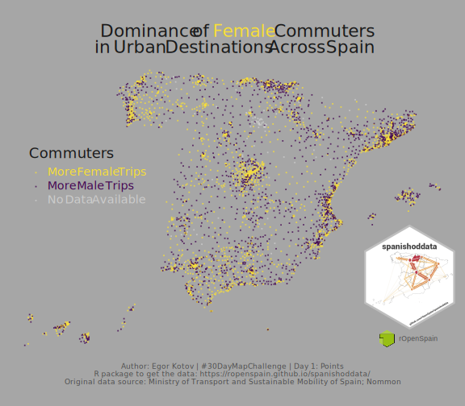
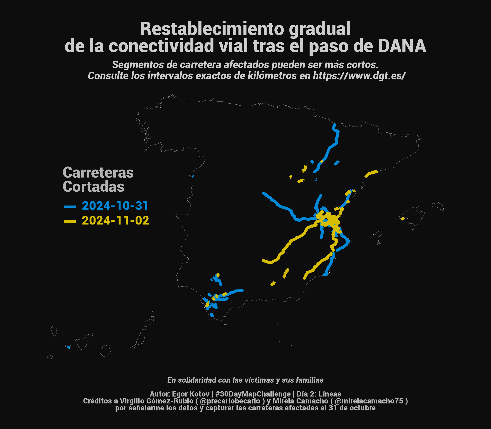

# 2024 #30DayMapChallenge

[https://30daymapchallenge.com/](https://30daymapchallenge.com/)

# 1. Points

**Dominance of Female Commuters in Urban Destinations Across Spain**

To recreate the plot, use the [`{spanishoddata}`](https://ropenspain.github.io/spanishoddata/) R package and the [R/01-points.R](R/01-points.R) script in this repository.

# 2. Lines

**Gradual Recovery of Road Connectivity after the Passage of (storm) DANA in Spain**

*In solidarity with the victims and their families.*

Affected road segments may be shorter. Check the exact kilometer intervals at https://www.dgt.es/.

Credits to Virgilio Gómez-Rubio ([@precariobecario](https://x.com/precariobecario)) and Mireia Camacho ([@mireiacamacho75](https://x.com/mireiacamacho75)) for pointing me to the data and [capturing](https://github.com/DataMirai/ShinyCarreterasInundaciones/blob/main/carreteras_cortadas.csv) the affected roads as of October 31.

To recreate the plot, use the [R/02-lines.R](R/02-lines.R) script in this repository.

# 3. Polygons

**Up to 2% of typical daily mobility in Spain was affected by (storm) DANA**

The map shows the affected municipalities in Spain and emphasizes the most affected areas by exaggerating the size of the polygons by the number of trips.

*In solidarity with the victims and their families.*

Based on road incidents data by [https://www.dgt.es/](https://www.dgt.es/) and open mobility data by [https://www.transportes.gob.es/](https://www.transportes.gob.es/ministerio/proyectos-singulares/estudios-de-movilidad-con-big-data/opendata-movilidad).

# 4. Hexagons

*skipped for now*

# 5. A Journey

All journeys in Spain in one day.

